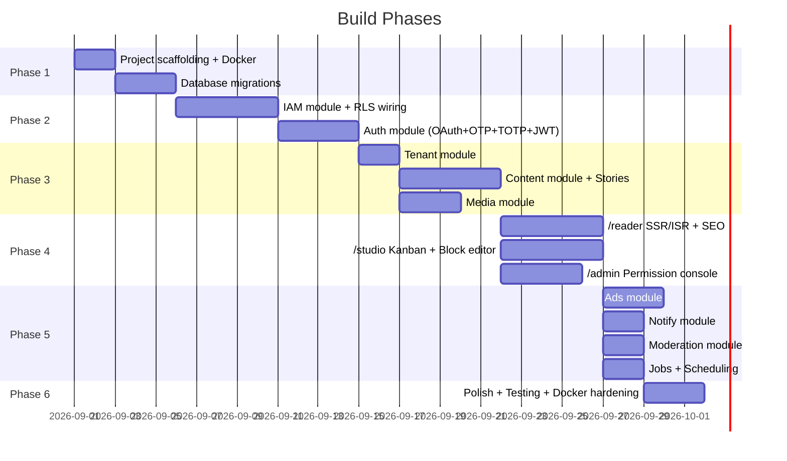

# Hybrid Regional News Platform — Full Implementation Plan

A multi-tenant regional news platform serving all of India with **Tenant = State** isolation, a unified editorial hierarchy, 5 languages (Hindi, English, Bengali, Marathi, Tamil), full RBAC+ABAC permissions, and Docker-based local development.

## Architecture Summary

```mermaid
graph TB
    subgraph "Frontend — Next.js App Router"
        R["/reader — SSR/ISR Public Site"]
        S["/studio — Newsroom CMS"]
        A["/admin — Permission Console"]
    end

    subgraph "Go API Gateway (Fiber)"
        GW["Auth · Rate Limit · Tenant Context"]
    end

    subgraph "Domain Modules (Single Binary)"
        AUTH["auth"]
        IAM["iam (RBAC/ABAC)"]
        CONTENT["content"]
        MEDIA["media"]
        ADS["ads"]
        SEO["seo"]
        NOTIFY["notify"]
        MOD["moderation"]
        TENANT["tenant"]
    end

    subgraph "Infrastructure"
        PG["PostgreSQL + RLS"]
        RD["Redis"]
        MS["Meilisearch"]
        S3["MinIO (S3-compat)"]
    end

    R --> GW
    S --> GW
    A --> GW
    GW --> AUTH
    GW --> IAM
    GW --> CONTENT
    GW --> MEDIA
    GW --> ADS
    GW --> SEO
    GW --> NOTIFY
    GW --> MOD
    GW --> TENANT
    AUTH --> PG
    IAM --> PG
    CONTENT --> PG
    CONTENT --> MS
    MEDIA --> S3
    AUTH --> RD
    CONTENT --> RD
end
```

---

## User Review Required

> [!IMPORTANT]
> **Single editorial hierarchy + state tenants**: You said one editorial team covers all India, but content is isolated per state. This means:
> - A **national editor** needs cross-tenant access (can view/edit content in any state)
> - A **state editor** is scoped to one tenant
> - A **reporter** is scoped to one tenant + possibly specific districts
> - The `UserTenantMapping` table allows assigning one user to multiple tenants with different roles
>
> This is supported by the architecture. National-level roles will be mapped to multiple tenants.

> [!IMPORTANT]
> **Shared national content**: Articles tagged as "national" need to appear across all state editions. Two approaches:
> 1. **National tenant** — a special tenant (id=0 or `national`) whose content is visible to all `/reader` routes
> 2. **Cross-tenant flag** — an `is_national` boolean on articles that RLS policies exempt from tenant filtering
>
> **Recommendation**: Option 1 (national tenant). Cleaner RLS, national editors belong to the national tenant, and state editors can "syndicate" national content into their state feeds without copying rows.

> [!WARNING]
> **Full architecture = large codebase**. This plan covers ~50+ database tables, 9 Go modules, 3 Next.js route groups, Docker infrastructure. Estimated build: **4-6 weeks** of focused development for a working system. The build order in §13 of your prompt is correct — IAM first, then auth, then content, then reader.

## Open Questions

> [!IMPORTANT]
> 1. **National content model**: Do you prefer a dedicated "National" tenant for shared content, or a cross-tenant flag on articles? (Recommended: National tenant)
> 2. **Ad system priority**: Should ads (Google Ad Manager + Prebid) be in the initial build, or added as a second phase?
> 3. **Wire feeds**: Do you currently receive PTI/ANI feeds, or should we skip wire feed polling initially?
> 4. **Mobile app**: Is a React Native / Flutter mobile app planned? This affects API design (pure REST vs GraphQL).
> 5. **Domain name**: Do you have a domain? Needed for OAuth redirect URIs and email templates.

---

## Proposed Changes

### Phase 1: Project Scaffolding & Infrastructure

#### [NEW] Project root structure

```
c:\go\
├── docker-compose.yml          # Postgres, Redis, Meilisearch, MinIO
├── Dockerfile                  # Go API multi-stage build
├── Makefile                    # Common commands (migrate, seed, test, lint)
├── .env.example                # Environment variables template
├── go.mod / go.sum
│
├── cmd/
│   └── api/
│       └── main.go             # Entrypoint, wires all modules
│
├── internal/                   # Domain modules (not importable externally)
│   ├── auth/                   # OAuth, OTP, TOTP, JWT, refresh tokens
│   ├── iam/                    # RBAC, ABAC, menus, permissions, audit
│   ├── tenant/                 # Tenant/district CRUD, module enablement
│   ├── content/                # Articles, stories, live blogs, versions
│   ├── media/                  # Upload, compression, CDN refs
│   ├── ads/                    # Ad slots, Prebid config, reconciliation
│   ├── seo/                    # Sitemap, structured data, AMP
│   ├── notify/                 # Push/email digests
│   └── moderation/             # Comments, UGC review queue
│
├── pkg/                        # Shared utilities (importable)
│   ├── middleware/              # Tenant context, RLS, authz guard
│   ├── rls/                    # SET LOCAL helpers
│   ├── database/               # Connection pool, migration runner
│   ├── config/                 # Env parsing, validation
│   └── response/               # Standard API response helpers
│
├── migrations/                 # SQL migration files (golang-migrate)
│
└── frontend/                   # Next.js app
    ├── package.json
    ├── next.config.js
    ├── app/
    │   ├── (reader)/           # Public site route group
    │   ├── (studio)/           # Newsroom CMS route group
    │   └── (admin)/            # Permission console route group
    ├── components/
    ├── lib/
    └── styles/
```

#### [NEW] `docker-compose.yml`

Services:
| Service | Image | Port | Purpose |
|---|---|---|---|
| `postgres` | `postgres:16-alpine` | 5432 | Primary DB with RLS |
| `redis` | `redis:7-alpine` | 6379 | Sessions, cache, trending |
| `meilisearch` | `getmeili/meilisearch:v1.12` | 7700 | Full-text search |
| `minio` | `minio/minio:latest` | 9000/9001 | S3-compatible object storage |
| `api` | Custom Dockerfile | 8080 | Go API server |
| `frontend` | Node 22 | 3000 | Next.js dev server |

---

### Phase 2: Database Schema & Migrations (IAM + Core)

#### [NEW] `migrations/001_tenants.up.sql`

```sql
-- Tenants (State editions + 1 National tenant)
CREATE TABLE tenants (
    id          SERIAL PRIMARY KEY,
    name        VARCHAR(100) NOT NULL,          -- "Maharashtra", "National"
    slug        VARCHAR(50) UNIQUE NOT NULL,     -- "maharashtra", "national"
    is_national BOOLEAN DEFAULT FALSE,           -- only 1 row should be true
    config      JSONB DEFAULT '{}',              -- theme overrides, feature flags
    is_active   BOOLEAN DEFAULT TRUE,
    created_at  TIMESTAMPTZ DEFAULT NOW(),
    updated_at  TIMESTAMPTZ DEFAULT NOW()
);

-- Districts within a state tenant
CREATE TABLE districts (
    id          SERIAL PRIMARY KEY,
    tenant_id   INT NOT NULL REFERENCES tenants(id),
    name        VARCHAR(100) NOT NULL,
    slug        VARCHAR(50) NOT NULL,
    is_active   BOOLEAN DEFAULT TRUE,
    created_at  TIMESTAMPTZ DEFAULT NOW(),
    UNIQUE(tenant_id, slug)
);
```

#### [NEW] `migrations/002_users_auth.up.sql`

```sql
-- Unified users table (viewers + staff)
CREATE TABLE users (
    id              BIGSERIAL PRIMARY KEY,
    email           VARCHAR(255) UNIQUE,
    phone           VARCHAR(20) UNIQUE,
    password_hash   TEXT,                        -- Argon2id, NULL for OAuth/OTP-only
    display_name    VARCHAR(100),
    avatar_url      TEXT,
    provider        VARCHAR(20) DEFAULT 'email', -- email, google, phone
    provider_id     VARCHAR(255),
    is_staff        BOOLEAN DEFAULT FALSE,
    is_super_admin  BOOLEAN DEFAULT FALSE,       -- bypass flag, NOT a role
    totp_secret     TEXT,                        -- mandatory for staff
    totp_enabled    BOOLEAN DEFAULT FALSE,
    is_active       BOOLEAN DEFAULT TRUE,
    created_at      TIMESTAMPTZ DEFAULT NOW(),
    updated_at      TIMESTAMPTZ DEFAULT NOW()
);

-- Refresh tokens (one per device)
CREATE TABLE refresh_tokens (
    id          BIGSERIAL PRIMARY KEY,
    user_id     BIGINT NOT NULL REFERENCES users(id) ON DELETE CASCADE,
    token_hash  TEXT NOT NULL UNIQUE,
    device_info JSONB DEFAULT '{}',
    expires_at  TIMESTAMPTZ NOT NULL,
    created_at  TIMESTAMPTZ DEFAULT NOW()
);

-- OTP tracking (rate-limited)
CREATE TABLE otp_requests (
    id          BIGSERIAL PRIMARY KEY,
    phone       VARCHAR(20) NOT NULL,
    otp_hash    TEXT NOT NULL,
    purpose     VARCHAR(20) DEFAULT 'login',     -- login, verify_phone
    attempts    INT DEFAULT 0,
    expires_at  TIMESTAMPTZ NOT NULL,
    created_at  TIMESTAMPTZ DEFAULT NOW()
);
```

#### [NEW] `migrations/003_iam_rbac.up.sql`

Full RBAC + ABAC tables:

```sql
-- Roles (tenant-scoped)
CREATE TABLE roles (
    id          SERIAL PRIMARY KEY,
    tenant_id   INT NOT NULL REFERENCES tenants(id),
    name        VARCHAR(50) NOT NULL,
    description TEXT,
    is_active   BOOLEAN DEFAULT TRUE,
    created_at  TIMESTAMPTZ DEFAULT NOW(),
    UNIQUE(tenant_id, name)
);

-- Menu modules (content, media, ads, seo, users, settings...)
CREATE TABLE menus (
    id          SERIAL PRIMARY KEY,
    name        VARCHAR(100) NOT NULL UNIQUE,    -- "articles", "media_library", "ad_slots"
    label       VARCHAR(100) NOT NULL,
    parent_id   INT REFERENCES menus(id),
    sort_order  INT DEFAULT 0,
    icon        VARCHAR(50)
);

-- Actions per menu
CREATE TABLE menu_actions (
    id          SERIAL PRIMARY KEY,
    menu_id     INT NOT NULL REFERENCES menus(id),
    action      VARCHAR(30) NOT NULL,            -- VIEW, ADD, EDIT, DELETE, PUBLISH, APPROVE, REJECT, EXPORT
    label       VARCHAR(100),
    UNIQUE(menu_id, action)
);

-- RBAC grants: role → menu_action (per tenant)
CREATE TABLE role_menu_actions (
    role_id         INT NOT NULL REFERENCES roles(id) ON DELETE CASCADE,
    menu_action_id  INT NOT NULL REFERENCES menu_actions(id),
    tenant_id       INT NOT NULL REFERENCES tenants(id),
    PRIMARY KEY (role_id, menu_action_id, tenant_id)
);

-- User ↔ Tenant ↔ Role mapping
CREATE TABLE user_tenant_mappings (
    user_id     BIGINT NOT NULL REFERENCES users(id) ON DELETE CASCADE,
    tenant_id   INT NOT NULL REFERENCES tenants(id),
    role_id     INT NOT NULL REFERENCES roles(id),
    is_active   BOOLEAN DEFAULT TRUE,
    created_at  TIMESTAMPTZ DEFAULT NOW(),
    PRIMARY KEY (user_id, tenant_id)
);

-- User district scoping (which districts a user can access within a tenant)
CREATE TABLE user_district_scopes (
    user_id     BIGINT NOT NULL REFERENCES users(id) ON DELETE CASCADE,
    tenant_id   INT NOT NULL REFERENCES tenants(id),
    district_id INT NOT NULL REFERENCES districts(id),
    PRIMARY KEY (user_id, tenant_id, district_id)
);

-- Permission overrides (exceptions)
CREATE TABLE user_permission_overrides (
    id              BIGSERIAL PRIMARY KEY,
    user_id         BIGINT NOT NULL REFERENCES users(id),
    tenant_id       INT NOT NULL REFERENCES tenants(id),
    menu_action_id  INT NOT NULL REFERENCES menu_actions(id),
    effect          VARCHAR(10) NOT NULL CHECK (effect IN ('GRANT', 'REVOKE')),
    reason          TEXT NOT NULL,
    valid_from      TIMESTAMPTZ,
    valid_until     TIMESTAMPTZ,
    granted_by      BIGINT NOT NULL REFERENCES users(id),
    created_at      TIMESTAMPTZ DEFAULT NOW()
);

-- ABAC policies
CREATE TABLE abac_policies (
    id          BIGSERIAL PRIMARY KEY,
    user_id     BIGINT NOT NULL REFERENCES users(id),
    tenant_id   INT NOT NULL REFERENCES tenants(id),
    attribute   VARCHAR(30) NOT NULL,            -- TIME_RANGE, IP_WHITELIST, DISTRICT_RESTRICT, DEVICE_TYPE
    value       JSONB NOT NULL,
    is_active   BOOLEAN DEFAULT TRUE,
    created_at  TIMESTAMPTZ DEFAULT NOW()
);

-- Audit log (every permission decision)
CREATE TABLE permission_audit_log (
    id              BIGSERIAL PRIMARY KEY,
    user_id         BIGINT NOT NULL,
    tenant_id       INT,
    menu_action_id  INT,
    action_name     VARCHAR(80),
    decision        VARCHAR(20) NOT NULL,        -- GRANTED, DENIED, OVERRIDE_GRANT, OVERRIDE_REVOKE
    reason          TEXT,
    ip_address      INET,
    user_agent      TEXT,
    created_at      TIMESTAMPTZ DEFAULT NOW()
);

-- Session context (active tenant switching)
CREATE TABLE user_session_contexts (
    user_id             BIGINT PRIMARY KEY REFERENCES users(id),
    active_tenant_id    INT REFERENCES tenants(id),
    active_district_id  INT REFERENCES districts(id),
    updated_at          TIMESTAMPTZ DEFAULT NOW()
);
```

#### [NEW] `migrations/004_content.up.sql`

```sql
-- Story groups translation variants
CREATE TABLE stories (
    id          UUID PRIMARY KEY DEFAULT gen_random_uuid(),
    tenant_id   INT NOT NULL REFERENCES tenants(id),
    created_at  TIMESTAMPTZ DEFAULT NOW()
);

-- Articles
CREATE TABLE articles (
    id              UUID PRIMARY KEY DEFAULT gen_random_uuid(),
    story_id        UUID REFERENCES stories(id),
    tenant_id       INT NOT NULL REFERENCES tenants(id),
    district_id     INT REFERENCES districts(id),
    language        VARCHAR(10) NOT NULL DEFAULT 'en',  -- en, hi, bn, mr, ta
    title           TEXT NOT NULL,
    slug            VARCHAR(300) NOT NULL,
    body            JSONB NOT NULL DEFAULT '[]',         -- block-based content
    excerpt         TEXT,
    status          VARCHAR(20) NOT NULL DEFAULT 'draft'
                    CHECK (status IN ('draft','review','approved','published','archived')),
    author_id       BIGINT NOT NULL REFERENCES users(id),
    editor_id       BIGINT REFERENCES users(id),
    reviewer_id     BIGINT REFERENCES users(id),
    is_breaking     BOOLEAN DEFAULT FALSE,
    is_featured     BOOLEAN DEFAULT FALSE,
    is_national     BOOLEAN DEFAULT FALSE,              -- visible across all tenants
    published_at    TIMESTAMPTZ,
    scheduled_at    TIMESTAMPTZ,
    meta_title      VARCHAR(200),
    meta_description VARCHAR(500),
    og_image        TEXT,
    featured_image  TEXT,
    view_count      BIGINT DEFAULT 0,
    created_at      TIMESTAMPTZ DEFAULT NOW(),
    updated_at      TIMESTAMPTZ DEFAULT NOW(),
    UNIQUE(tenant_id, slug, language)
);

-- Categories
CREATE TABLE categories (
    id          SERIAL PRIMARY KEY,
    tenant_id   INT NOT NULL REFERENCES tenants(id),
    name        VARCHAR(100) NOT NULL,
    slug        VARCHAR(100) NOT NULL,
    parent_id   INT REFERENCES categories(id),
    sort_order  INT DEFAULT 0,
    UNIQUE(tenant_id, slug)
);

-- Tags
CREATE TABLE tags (
    id      SERIAL PRIMARY KEY,
    name    VARCHAR(100) NOT NULL UNIQUE,
    slug    VARCHAR(100) NOT NULL UNIQUE
);

-- Article ↔ Category / Tag junction tables
CREATE TABLE article_categories (
    article_id  UUID NOT NULL REFERENCES articles(id) ON DELETE CASCADE,
    category_id INT NOT NULL REFERENCES categories(id),
    PRIMARY KEY (article_id, category_id)
);

CREATE TABLE article_tags (
    article_id UUID NOT NULL REFERENCES articles(id) ON DELETE CASCADE,
    tag_id     INT NOT NULL REFERENCES tags(id),
    PRIMARY KEY (article_id, tag_id)
);

-- Article version history
CREATE TABLE article_versions (
    id          BIGSERIAL PRIMARY KEY,
    article_id  UUID NOT NULL REFERENCES articles(id) ON DELETE CASCADE,
    edited_by   BIGINT NOT NULL REFERENCES users(id),
    diff        JSONB NOT NULL,
    snapshot    JSONB,                           -- full content snapshot for rollback
    created_at  TIMESTAMPTZ DEFAULT NOW()
);

-- Live blog entries
CREATE TABLE live_blog_entries (
    id          BIGSERIAL PRIMARY KEY,
    article_id  UUID NOT NULL REFERENCES articles(id) ON DELETE CASCADE,
    body        JSONB NOT NULL,
    author_id   BIGINT NOT NULL REFERENCES users(id),
    is_pinned   BOOLEAN DEFAULT FALSE,
    created_at  TIMESTAMPTZ DEFAULT NOW(),
    updated_at  TIMESTAMPTZ DEFAULT NOW()
);

-- Media library
CREATE TABLE media (
    id          UUID PRIMARY KEY DEFAULT gen_random_uuid(),
    tenant_id   INT NOT NULL REFERENCES tenants(id),
    uploader_id BIGINT NOT NULL REFERENCES users(id),
    filename    VARCHAR(500) NOT NULL,
    mime_type   VARCHAR(100) NOT NULL,
    file_size   BIGINT NOT NULL,
    storage_key TEXT NOT NULL,                   -- S3/MinIO key
    cdn_url     TEXT,
    alt_text    TEXT,
    caption     TEXT,
    width       INT,
    height      INT,
    variants    JSONB DEFAULT '{}',              -- {"thumb": "...", "medium": "...", "large": "..."}
    created_at  TIMESTAMPTZ DEFAULT NOW()
);

-- Comments (viewer-facing)
CREATE TABLE comments (
    id          BIGSERIAL PRIMARY KEY,
    article_id  UUID NOT NULL REFERENCES articles(id) ON DELETE CASCADE,
    user_id     BIGINT NOT NULL REFERENCES users(id),
    parent_id   BIGINT REFERENCES comments(id),
    body        TEXT NOT NULL,
    status      VARCHAR(20) DEFAULT 'pending'
                CHECK (status IN ('pending','approved','rejected','spam')),
    created_at  TIMESTAMPTZ DEFAULT NOW()
);
```

#### [NEW] `migrations/005_rls_policies.up.sql`

Row-Level Security for tenant isolation on all tenant-scoped tables:

```sql
-- Enable RLS on all tenant-scoped tables
ALTER TABLE articles ENABLE ROW LEVEL SECURITY;
ALTER TABLE stories ENABLE ROW LEVEL SECURITY;
ALTER TABLE categories ENABLE ROW LEVEL SECURITY;
ALTER TABLE media ENABLE ROW LEVEL SECURITY;
ALTER TABLE comments ENABLE ROW LEVEL SECURITY;
ALTER TABLE roles ENABLE ROW LEVEL SECURITY;
ALTER TABLE role_menu_actions ENABLE ROW LEVEL SECURITY;

-- Standard tenant isolation policy (applied to each table)
-- app.tenant_id and app.is_super_admin set via SET LOCAL in Go middleware

CREATE POLICY tenant_isolation ON articles
    USING (
        tenant_id = current_setting('app.tenant_id', true)::int
        OR is_national = TRUE
        OR current_setting('app.is_super_admin', true)::boolean = true
    );

CREATE POLICY tenant_isolation ON stories
    USING (
        tenant_id = current_setting('app.tenant_id', true)::int
        OR current_setting('app.is_super_admin', true)::boolean = true
    );

CREATE POLICY tenant_isolation ON categories
    USING (
        tenant_id = current_setting('app.tenant_id', true)::int
        OR current_setting('app.is_super_admin', true)::boolean = true
    );

CREATE POLICY tenant_isolation ON media
    USING (
        tenant_id = current_setting('app.tenant_id', true)::int
        OR current_setting('app.is_super_admin', true)::boolean = true
    );

CREATE POLICY tenant_isolation ON roles
    USING (
        tenant_id = current_setting('app.tenant_id', true)::int
        OR current_setting('app.is_super_admin', true)::boolean = true
    );

CREATE POLICY tenant_isolation ON role_menu_actions
    USING (
        tenant_id = current_setting('app.tenant_id', true)::int
        OR current_setting('app.is_super_admin', true)::boolean = true
    );
```

#### [NEW] `migrations/006_ads_seo.up.sql`

```sql
-- Ad placements
CREATE TABLE ad_slots (
    id          SERIAL PRIMARY KEY,
    tenant_id   INT NOT NULL REFERENCES tenants(id),
    name        VARCHAR(100) NOT NULL,           -- "header_leaderboard", "in_article_1"
    slot_type   VARCHAR(30) NOT NULL,            -- header, in_article, sidebar, native
    ad_unit_id  VARCHAR(200),                    -- Google Ad Manager unit ID
    config      JSONB DEFAULT '{}',              -- sizes, prebid params
    is_active   BOOLEAN DEFAULT TRUE,
    created_at  TIMESTAMPTZ DEFAULT NOW()
);

-- Sponsored content tracking
CREATE TABLE sponsored_articles (
    article_id  UUID PRIMARY KEY REFERENCES articles(id),
    sponsor     VARCHAR(200) NOT NULL,
    campaign_id VARCHAR(100),
    start_date  DATE,
    end_date    DATE
);

-- DPDP Act consent
CREATE TABLE consent_records (
    id              BIGSERIAL PRIMARY KEY,
    user_id         BIGINT REFERENCES users(id),
    consent_type    VARCHAR(50) NOT NULL,        -- analytics, ads_personalization, newsletter
    is_granted      BOOLEAN NOT NULL,
    policy_version  VARCHAR(20) NOT NULL,        -- tracks which policy text was agreed to
    ip_address      INET,
    created_at      TIMESTAMPTZ DEFAULT NOW()
);
```

#### [NEW] `migrations/007_seed_data.up.sql`

Seed tenants (states), default roles, menus, and menu actions:

- **Tenants**: National, Maharashtra, West Bengal, Jharkhand, Tamil Nadu, Bihar (initial set, expandable)
- **Roles per tenant**: `reporter`, `sub_editor`, `editor`, `state_admin`, `seo_manager`, `ad_manager`, `moderator`
- **Menus**: articles, stories, media_library, categories, tags, comments, ad_slots, users, roles, permissions, settings, analytics
- **Menu Actions**: VIEW, ADD, EDIT, DELETE, PUBLISH, APPROVE, REJECT, EXPORT per menu

---

### Phase 3: Go Backend — Core Modules

#### [NEW] `cmd/api/main.go`
Application entrypoint: loads config, connects to Postgres/Redis/Meilisearch/MinIO, initializes all modules, starts Fiber HTTP server.

#### [NEW] `pkg/config/config.go`
Environment-based configuration struct parsed with `caarlos0/env`.

#### [NEW] `pkg/database/postgres.go`
Connection pool setup with `pgxpool`, migration runner using `golang-migrate`.

#### [NEW] `pkg/database/redis.go`
Redis client setup with `go-redis/redis`.

#### [NEW] `pkg/rls/rls.go`
Helper functions to `SET LOCAL app.tenant_id` and `app.is_super_admin` within a transaction — called by middleware on every request.

#### [NEW] `pkg/middleware/tenant.go`
Fiber middleware that:
1. Extracts tenant from JWT claims or subdomain
2. Begins a Postgres transaction
3. Calls `rls.SetTenantContext(tx, tenantID, isSuperAdmin)`
4. Stores tx in Fiber context for downstream handlers

#### [NEW] `pkg/middleware/auth.go`
JWT validation, session extraction, attaches `Session` struct to context.

#### [NEW] `pkg/middleware/authz.go`
`RequirePermission(action string)` middleware — calls `IAMService.Can()`.

#### [NEW] `pkg/response/response.go`
Standard JSON response helpers: `Success()`, `Error()`, `Paginated()`.

---

#### [NEW] `internal/auth/` module

| File | Purpose |
|---|---|
| `service.go` | `AuthService` — register, login (email/OAuth/OTP), issue JWT, refresh, revoke |
| `handler.go` | HTTP handlers: `POST /auth/register`, `POST /auth/login`, `POST /auth/refresh`, `POST /auth/logout`, `POST /auth/otp/send`, `POST /auth/otp/verify`, `POST /auth/totp/setup`, `POST /auth/totp/verify` |
| `jwt.go` | JWT creation/validation with `golang-jwt` |
| `oauth.go` | Google OAuth2 flow |
| `otp.go` | Phone OTP generation, hashing, rate limiting |
| `totp.go` | TOTP setup/verify with `pquerna/otp` |
| `repository.go` | User + refresh token DB operations |

---

#### [NEW] `internal/iam/` module

| File | Purpose |
|---|---|
| `service.go` | `IAMService` — `Can()`, `AssignRole()`, `SetOverride()`, `SetABACPolicy()` |
| `evaluator.go` | The 5-step permission evaluation chain (§5.2 of the prompt) |
| `handler.go` | CRUD handlers for roles, menus, menu_actions, role_menu_actions, overrides, ABAC policies |
| `repository.go` | All IAM table queries |
| `audit.go` | Audit log writer (every decision logged) |

---

#### [NEW] `internal/tenant/` module

| File | Purpose |
|---|---|
| `service.go` | `TenantService` — CRUD tenants, districts, feature flags |
| `handler.go` | `GET/POST/PUT /tenants`, `GET/POST/PUT /tenants/:id/districts` |
| `repository.go` | Tenant/district DB operations |

---

#### [NEW] `internal/content/` module

| File | Purpose |
|---|---|
| `service.go` | `ContentService` — create/update/transition articles, manage stories, live blogs |
| `handler.go` | Full article CRUD, story linking, version history, status transitions |
| `search.go` | Meilisearch indexing and query |
| `repository.go` | Article/story/version/live_blog DB operations |
| `workflow.go` | Status transition rules (draft→review→approved→published→archived) |

---

#### [NEW] `internal/media/` module

| File | Purpose |
|---|---|
| `service.go` | Upload to MinIO, generate variants (thumb/medium/large), return CDN URL |
| `handler.go` | `POST /media/upload`, `GET /media`, `DELETE /media/:id` |
| `processor.go` | Image resizing/compression pipeline (using `disintegration/imaging`) |
| `repository.go` | Media metadata DB operations |

---

#### [NEW] `internal/ads/` module (Phase 2 — can be stubbed initially)

| File | Purpose |
|---|---|
| `service.go` | Ad slot management, Prebid config generation |
| `handler.go` | CRUD for ad_slots, sponsored articles |
| `repository.go` | Ad slot DB operations |

---

#### [NEW] `internal/seo/` module

| File | Purpose |
|---|---|
| `service.go` | Sitemap generation (per tenant), structured data builders |
| `handler.go` | `GET /sitemap.xml`, `GET /sitemap/:tenant.xml` |
| `structured.go` | `NewsArticle` schema.org JSON-LD builder |

---

#### [NEW] `internal/notify/` module

| File | Purpose |
|---|---|
| `service.go` | Breaking news push, daily digest email |
| `handler.go` | Subscription management endpoints |

---

#### [NEW] `internal/moderation/` module

| File | Purpose |
|---|---|
| `service.go` | Comment approval queue, spam detection |
| `handler.go` | Comment CRUD, moderation actions (approve/reject/spam) |
| `repository.go` | Comment DB operations |

---

### Phase 4: API Routes

```
# Public (reader)
GET    /api/v1/articles                    # list (paginated, filterable by tenant/district/language/category)
GET    /api/v1/articles/:slug              # single article
GET    /api/v1/articles/:id/comments       # comments
POST   /api/v1/articles/:id/comments       # add comment (auth required)
GET    /api/v1/categories                  # categories for current tenant
GET    /api/v1/trending                    # trending articles (per tenant)
GET    /api/v1/search                      # full-text search via Meilisearch

# Auth
POST   /api/v1/auth/register
POST   /api/v1/auth/login
POST   /api/v1/auth/refresh
POST   /api/v1/auth/logout
POST   /api/v1/auth/otp/send
POST   /api/v1/auth/otp/verify
POST   /api/v1/auth/google/callback
POST   /api/v1/auth/totp/setup
POST   /api/v1/auth/totp/verify

# Studio (staff, RequirePermission middleware)
GET    /api/v1/studio/articles             # Kanban view (all statuses)
POST   /api/v1/studio/articles             # create draft
PUT    /api/v1/studio/articles/:id         # edit
POST   /api/v1/studio/articles/:id/transition  # status change (draft→review, etc.)
GET    /api/v1/studio/articles/:id/versions    # version history
POST   /api/v1/studio/live-blogs/:id/entries   # add live blog entry
POST   /api/v1/studio/media/upload         # media upload
GET    /api/v1/studio/media                # media library

# Admin (state_admin+, RequirePermission middleware)
GET    /api/v1/admin/tenants
POST   /api/v1/admin/tenants
PUT    /api/v1/admin/tenants/:id
GET    /api/v1/admin/tenants/:id/districts
POST   /api/v1/admin/tenants/:id/districts
GET    /api/v1/admin/users
POST   /api/v1/admin/users/:id/roles       # assign role
POST   /api/v1/admin/users/:id/districts    # assign district scope
GET    /api/v1/admin/roles
POST   /api/v1/admin/roles
PUT    /api/v1/admin/roles/:id/permissions  # set role_menu_actions
POST   /api/v1/admin/overrides              # set permission override
GET    /api/v1/admin/audit-log              # permission audit trail
POST   /api/v1/admin/abac-policies          # ABAC policy management
```

---

### Phase 5: Next.js Frontend

#### [NEW] `frontend/` — Next.js App Router project

**Route Groups:**

| Route Group | Purpose | Key Pages |
|---|---|---|
| `(reader)` | Public news site, SSR/ISR | Home, Article, Category, Search, State selector |
| `(studio)` | Newsroom CMS (staff only) | Kanban board, Block editor, Live blog composer, Media library |
| `(admin)` | Permission console (admin only) | Tenant manager, User manager, Role editor, Permission override editor, ABAC policy editor, Audit log viewer |

**Key frontend features:**
- **SSR/ISR** for reader pages (News SEO critical)
- **Block editor** — Notion-style for article body (using Tiptap or Editor.js)
- **Kanban board** — drag-and-drop status transitions
- **Dark mode** + **data-saver mode** (tier-2/3 India bandwidth)
- **hreflang** tags generated from Story→Article language variants
- **AMP pages** for high-traffic articles
- **Responsive** — mobile-first, PWA-ready
- **Design system** — shared tokens, tenant-level theme overrides (color/logo only)

---

### Phase 6: Jobs & Scheduling

#### [NEW] `internal/jobs/` module

Using `robfig/cron` initially (single instance), migrating to River/Temporal later:

| Job | Implementation |
|---|---|
| Trending recalculation | Every 5 min, per-tenant, Redis sorted sets |
| Sitemap regeneration | Nightly, per tenant, writes to object storage |
| Content archival | Monthly, moves old articles to `archived` status |
| Notification digests | Daily, per tenant, email queue |

---

## Verification Plan

### Automated Tests

```bash
# Unit tests (all modules)
go test ./internal/... -v -race

# Integration tests (requires Docker services)
docker compose up -d postgres redis
go test ./internal/... -tags=integration -v

# IAM-specific tests (critical path)
go test ./internal/iam/... -v -run TestPermissionEvaluation

# Frontend
cd frontend && npm test

# Lint
golangci-lint run ./...
cd frontend && npm run lint
```

### Manual Verification

1. **RLS isolation**: Create articles in two different tenants, verify cross-tenant queries return empty
2. **Permission chain**: Test all 5 evaluation steps with a dedicated test user
3. **super_admin bypass**: Verify super_admin can access all tenants, all actions are audit-logged
4. **Editorial workflow**: Create article → submit for review → approve → publish → verify on reader
5. **Multi-language**: Create Story with Hindi + English articles, verify hreflang tags
6. **Docker**: `docker compose up` should bring up the entire stack locally

---

## Build Order (Matching §13 of Prompt)



**Total estimated timeline: ~6 weeks** for the full system (can be compressed with parallel work on frontend + backend).
