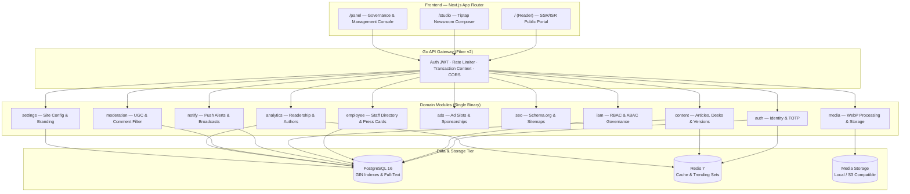

# National & Regional News Platform — Full Architecture & Implementation Guide

A unified, high-performance newsroom and digital publishing platform serving national and state coverage across India with 5 languages (Hindi, English, Bengali, Marathi, Tamil), full RBAC+ABAC governance, and sub-millisecond reader delivery.

---

## 1. System Architecture



---

## 2. Core Architectural Principles (Single-Tenant Design)

1. **Unified Platform, Zero Tenant Overhead**:
   - **No Multi-Tenant / Tenant ID Logic**: Completely eliminated tenant tables, tenant IDs, cross-tenant RLS policies, and context switching.
   - **National & Regional Desks as Taxonomy**: States, national bureaus, and district beats are modeled as a hierarchical Category Taxonomy (`दुनिया`, `भारत > राष्ट्रीय`, `झारखंड > रांची`, `बिहार > पटना`).
   - **Unified Editorial Hierarchy**: All staff belong to a single newsroom with granular IAM roles (`super_admin`, `editor`, `sub_editor`, `reporter`, `moderator`) and category-level scoping.

2. **Sub-Millisecond Read Performance**:
   - Pre-computed lexical `search_vector` tsvector column with PostgreSQL GIN index.
   - Trigram indexing (`pg_trgm`) for fuzzy substring searching.
   - Partial indexes on `WHERE status = 'published'` to reduce active index memory footprint by ~80%.

3. **Enterprise IAM Governance**:
   - 16 synchronized menus matching all admin panel views.
   - Dynamic permissions with 6 standard actions per menu: `VIEW`, `ADD`, `EDIT`, `DELETE`, `PUBLISH`, `APPROVE`.
   - Category scoping (`user_category_scopes`) allowing beat reporters and state editors to be restricted to specific beats.
   - Comprehensive audit trail (`permission_audit_log`) recording every administrative decision.

---

## 3. Canonical Database Schema

All tables and essential seeds are consolidated into a single migration file:  
[`migrations/001_init_production_schema.up.sql`](file:///i:/workspace/go/backend/migrations/001_init_production_schema.up.sql)

### 3.1 Users, Auth & Staff Directory

```sql
-- 1. Users (Unified viewers and newsroom staff)
CREATE TABLE users (
    id              BIGSERIAL PRIMARY KEY,
    email           VARCHAR(255) UNIQUE NOT NULL,
    phone           VARCHAR(50),
    password_hash   VARCHAR(255) NOT NULL,
    first_name      VARCHAR(100),
    last_name       VARCHAR(100),
    display_name    VARCHAR(200),
    avatar_url      TEXT DEFAULT '',
    provider        VARCHAR(50) DEFAULT 'local',
    totp_enabled    BOOLEAN DEFAULT FALSE,
    is_active       BOOLEAN DEFAULT TRUE,
    is_staff        BOOLEAN DEFAULT TRUE,
    is_super_admin  BOOLEAN DEFAULT FALSE,
    last_login_at   TIMESTAMPTZ,
    created_at      TIMESTAMPTZ DEFAULT NOW(),
    updated_at      TIMESTAMPTZ DEFAULT NOW()
);

-- 2. Employees (Newsroom journalists, editors, press accreditation)
CREATE TABLE employees (
    id              BIGSERIAL PRIMARY KEY,
    user_id         BIGINT UNIQUE NOT NULL REFERENCES users(id) ON DELETE CASCADE,
    employee_code   VARCHAR(100) UNIQUE NOT NULL,
    department      VARCHAR(100) NOT NULL DEFAULT 'Editorial',
    designation     VARCHAR(150) NOT NULL DEFAULT 'Special Correspondent',
    district_id     INT,
    address         TEXT DEFAULT '',
    pin_code        VARCHAR(20) DEFAULT '',
    bio             TEXT DEFAULT '',
    press_card_no   VARCHAR(100) DEFAULT '',
    x_handle        VARCHAR(100) DEFAULT '',
    facebook        VARCHAR(200) DEFAULT '',
    instagram       VARCHAR(200) DEFAULT '',
    youtube         VARCHAR(200) DEFAULT '',
    is_active       BOOLEAN DEFAULT TRUE,
    joined_at       TIMESTAMPTZ DEFAULT NOW(),
    created_at      TIMESTAMPTZ DEFAULT NOW(),
    updated_at      TIMESTAMPTZ DEFAULT NOW()
);

-- 3. Sessions & Tokens
CREATE TABLE refresh_tokens (
    id          BIGSERIAL PRIMARY KEY,
    user_id     BIGINT REFERENCES users(id) ON DELETE CASCADE,
    token_hash  VARCHAR(255) UNIQUE NOT NULL,
    is_revoked  BOOLEAN DEFAULT FALSE,
    expires_at  TIMESTAMPTZ NOT NULL,
    created_at  TIMESTAMPTZ DEFAULT NOW()
);

CREATE TABLE otp_requests (
    id          SERIAL PRIMARY KEY,
    phone       VARCHAR(50) NOT NULL,
    otp_hash    VARCHAR(255) NOT NULL,
    attempts    INT DEFAULT 0,
    expires_at  TIMESTAMPTZ NOT NULL,
    created_at  TIMESTAMPTZ DEFAULT NOW()
);
```

### 3.2 IAM Governance, Menus & Permissions

```sql
-- Roles
CREATE TABLE roles (
    id          SERIAL PRIMARY KEY,
    name        VARCHAR(100) UNIQUE NOT NULL,
    description TEXT,
    is_system   BOOLEAN DEFAULT TRUE,
    is_active   BOOLEAN DEFAULT TRUE NOT NULL,
    created_at  TIMESTAMPTZ DEFAULT NOW(),
    updated_at  TIMESTAMPTZ DEFAULT NULL
);

-- Navigation Menus (16 Active Modules)
CREATE TABLE menus (
    id          SERIAL PRIMARY KEY,
    name        VARCHAR(100) UNIQUE NOT NULL,
    label       VARCHAR(150) NOT NULL,
    icon        VARCHAR(100) DEFAULT '',
    path        VARCHAR(255) DEFAULT '',
    parent_id   INT REFERENCES menus(id) ON DELETE SET NULL,
    sort_order  INT DEFAULT 0,
    is_active   BOOLEAN DEFAULT TRUE
);

-- Actions per Menu (VIEW, ADD, EDIT, DELETE, PUBLISH, APPROVE)
CREATE TABLE menu_actions (
    id          SERIAL PRIMARY KEY,
    menu_id     INT REFERENCES menus(id) ON DELETE CASCADE,
    action      VARCHAR(50) NOT NULL,
    label       VARCHAR(150) DEFAULT '',
    UNIQUE(menu_id, action)
);

-- Role Grants
CREATE TABLE role_menu_actions (
    role_id         INT REFERENCES roles(id) ON DELETE CASCADE,
    menu_action_id  INT REFERENCES menu_actions(id) ON DELETE CASCADE,
    PRIMARY KEY(role_id, menu_action_id)
);

-- User Role Assignment
CREATE TABLE user_roles (
    user_id     BIGINT REFERENCES users(id) ON DELETE CASCADE,
    role_id     INT REFERENCES roles(id) ON DELETE CASCADE,
    is_active   BOOLEAN DEFAULT TRUE,
    created_at  TIMESTAMPTZ DEFAULT NOW(),
    PRIMARY KEY(user_id, role_id)
);

-- Beat / Category Scoping
CREATE TABLE user_category_scopes (
    user_id     BIGINT REFERENCES users(id) ON DELETE CASCADE,
    category_id INT REFERENCES categories(id) ON DELETE CASCADE,
    assigned_by BIGINT REFERENCES users(id) ON DELETE SET NULL,
    created_at  TIMESTAMPTZ DEFAULT NOW(),
    PRIMARY KEY(user_id, category_id)
);

-- Security & Permission Audit Log
CREATE TABLE permission_audit_log (
    id              BIGSERIAL PRIMARY KEY,
    user_id         BIGINT NOT NULL,
    menu_action_id  INT,
    action_name     VARCHAR(80),
    decision        VARCHAR(20) NOT NULL,
    reason          TEXT,
    ip_address      INET,
    user_agent      TEXT,
    request_id      VARCHAR(100),
    created_at      TIMESTAMPTZ DEFAULT NOW()
);
```

### 3.3 Content & Editorial Pipeline

```sql
-- Editorial Taxonomy
CREATE TABLE categories (
    id          SERIAL PRIMARY KEY,
    parent_id   INT REFERENCES categories(id) ON DELETE SET NULL,
    level       INT DEFAULT 1,
    name        VARCHAR(150) NOT NULL,
    slug        VARCHAR(150) UNIQUE NOT NULL,
    path        TEXT,
    icon        VARCHAR(50),
    sort_order  INT DEFAULT 0,
    is_active   BOOLEAN DEFAULT TRUE,
    created_at  TIMESTAMPTZ DEFAULT NOW(),
    updated_at  TIMESTAMPTZ DEFAULT NOW()
);

CREATE TABLE tags (
    id          SERIAL PRIMARY KEY,
    name        VARCHAR(100) UNIQUE NOT NULL,
    slug        VARCHAR(100) UNIQUE NOT NULL,
    created_at  TIMESTAMPTZ DEFAULT NOW()
);

-- Core Articles
CREATE TABLE articles (
    id                  UUID PRIMARY KEY DEFAULT uuid_generate_v4(),
    story_id            VARCHAR(255),
    district_id         INT,
    language            VARCHAR(10) DEFAULT 'hi',
    title               TEXT NOT NULL,
    slug                VARCHAR(255) UNIQUE NOT NULL,
    body                TEXT,
    excerpt             TEXT,
    summary             TEXT,
    content             TEXT,
    status              VARCHAR(50) DEFAULT 'published',
    author_id           BIGINT REFERENCES users(id) ON DELETE SET NULL,
    editor_id           BIGINT REFERENCES users(id) ON DELETE SET NULL,
    reviewer_id         BIGINT REFERENCES users(id) ON DELETE SET NULL,
    is_breaking         BOOLEAN DEFAULT FALSE,
    is_featured         BOOLEAN DEFAULT FALSE,
    is_national         BOOLEAN DEFAULT FALSE,
    published_at        TIMESTAMPTZ DEFAULT NOW(),
    scheduled_at        TIMESTAMPTZ,
    meta_title          TEXT DEFAULT '',
    meta_description    TEXT DEFAULT '',
    og_image            TEXT DEFAULT '',
    featured_image      TEXT DEFAULT '',
    featured_image_url  TEXT DEFAULT '',
    caption             TEXT DEFAULT '',
    primary_category_id INT REFERENCES categories(id) ON DELETE SET NULL,
    view_count          INT DEFAULT 0,
    search_vector       tsvector GENERATED ALWAYS AS (
        to_tsvector('simple', COALESCE(title, '') || ' ' || COALESCE(excerpt, '') || ' ' || COALESCE(summary, ''))
    ) STORED,
    created_at          TIMESTAMPTZ DEFAULT NOW(),
    updated_at          TIMESTAMPTZ DEFAULT NOW()
);

-- Version History & Snapshots
CREATE TABLE article_versions (
    id          BIGSERIAL PRIMARY KEY,
    article_id  UUID NOT NULL REFERENCES articles(id) ON DELETE CASCADE,
    edited_by   BIGINT NOT NULL REFERENCES users(id),
    diff        JSONB NOT NULL DEFAULT '{}',
    snapshot    JSONB,
    version_num INT DEFAULT 1,
    created_at  TIMESTAMPTZ DEFAULT NOW()
);

-- Live Blog Stream
CREATE TABLE live_blog_entries (
    id          SERIAL PRIMARY KEY,
    article_id  UUID NOT NULL REFERENCES articles(id) ON DELETE CASCADE,
    headline    VARCHAR(255) DEFAULT '',
    title       VARCHAR(255) DEFAULT '',
    body        JSONB DEFAULT '""'::jsonb,
    content     TEXT DEFAULT '',
    author_id   BIGINT REFERENCES users(id) ON DELETE SET NULL,
    is_pinned   BOOLEAN DEFAULT FALSE,
    is_breaking BOOLEAN DEFAULT FALSE,
    created_at  TIMESTAMPTZ DEFAULT NOW()
);

-- Comments & Community
CREATE TABLE comments (
    id          SERIAL PRIMARY KEY,
    article_id  UUID NOT NULL REFERENCES articles(id) ON DELETE CASCADE,
    user_id     BIGINT REFERENCES users(id) ON DELETE SET NULL,
    parent_id   INT REFERENCES comments(id) ON DELETE CASCADE,
    author_name VARCHAR(150),
    body        TEXT,
    content     TEXT NOT NULL,
    status      VARCHAR(50) DEFAULT 'approved',
    is_approved BOOLEAN DEFAULT TRUE,
    created_at  TIMESTAMPTZ DEFAULT NOW()
);

-- Media Assets
CREATE TABLE media (
    id          UUID PRIMARY KEY DEFAULT uuid_generate_v4(),
    uploader_id BIGINT REFERENCES users(id) ON DELETE SET NULL,
    filename    VARCHAR(255) NOT NULL,
    mime_type   VARCHAR(100) DEFAULT '',
    category    VARCHAR(50) DEFAULT 'news',
    folder      VARCHAR(100) DEFAULT 'general',
    file_size   BIGINT DEFAULT 0,
    storage_path TEXT DEFAULT '',
    url         TEXT DEFAULT '',
    alt_text    TEXT DEFAULT '',
    caption     TEXT DEFAULT '',
    width       INT DEFAULT 0,
    height      INT DEFAULT 0,
    created_at  TIMESTAMPTZ DEFAULT NOW()
);
```

### 3.4 Engagement, Settings & Monetization

```sql
-- Site Settings
CREATE TABLE site_settings (
    id              SERIAL PRIMARY KEY,
    site_name       VARCHAR(255) DEFAULT 'NewsRoom',
    logo_url        TEXT,
    contact_email   VARCHAR(255),
    description     TEXT,
    updated_at      TIMESTAMPTZ DEFAULT NOW()
);

-- Broadcast Push Subscriptions
CREATE TABLE push_subscriptions (
    id          SERIAL PRIMARY KEY,
    district_id INT,
    user_id     BIGINT REFERENCES users(id) ON DELETE SET NULL,
    endpoint    TEXT UNIQUE NOT NULL,
    p256dh_key  TEXT,
    auth_key    TEXT,
    user_agent  TEXT,
    is_active   BOOLEAN DEFAULT TRUE,
    created_at  TIMESTAMPTZ DEFAULT NOW(),
    updated_at  TIMESTAMPTZ DEFAULT NOW()
);

-- Ad Placements
CREATE TABLE ad_slots (
    id          SERIAL PRIMARY KEY,
    name        VARCHAR(100) NOT NULL,
    slot_type   VARCHAR(30) NOT NULL,
    ad_unit_id  VARCHAR(200),
    config      JSONB DEFAULT '{}',
    is_active   BOOLEAN DEFAULT TRUE,
    created_at  TIMESTAMPTZ DEFAULT NOW()
);

CREATE TABLE sponsored_articles (
    article_id  UUID PRIMARY KEY REFERENCES articles(id) ON DELETE CASCADE,
    sponsor     VARCHAR(200) NOT NULL,
    campaign_id VARCHAR(100),
    start_date  DATE,
    end_date    DATE
);
```

---

## 4. Active Navigation Matrix (16 Synchronized Modules)

| # | Menu Key | UI Label | Path | Primary Responsibility |
|---|---|---|---|---|
| 1 | `dashboard` | Dashboard | `/panel/dashboard` | Key platform metrics, quick stats, quick publish shortcuts |
| 2 | `articles` | Articles | `/panel/articles` | Full newsroom editorial workflow, status filter, search |
| 3 | `categories` | Categories | `/panel/categories` | Hierarchical taxonomy (National, State, District subdesks) |
| 4 | `homepage` | Home Categories & Layout | `/panel/homepage` | Dynamic section ordering, category carousels, video blocks |
| 5 | `tags` | Tags | `/panel/tags` | Trending hashtags and story topic markers |
| 6 | `media_library` | Media | `/panel/media` | Uploads, WebP transformations, folder categorization |
| 7 | `live_blogs` | Live Blog | `/panel/liveblog` | Real-time breaking coverage, SSE live streaming |
| 8 | `notifications` | Broadcast & Alerts | `/panel/notifications` | Web push broadcasts, flash notifications, subscriber stats |
| 9 | `reports` | Reports | `/panel/reports` | Editorial production reports, risk tracking, audit dumps |
| 10 | `users` | Team & Staff | `/panel/users` | Journalist directory, press card numbers, designation, onboarding |
| 11 | `comments` | Comments | `/panel/comments` | Community comment moderation queue (approve/reject/spam) |
| 12 | `analytics` | Analytics | `/panel/analytics` | View counts, author leaderboards, category breakdowns |
| 13 | `roles` | Roles & Permissions | `/panel/roles` | RBAC matrix configuration, system roles, scoping |
| 14 | `settings` | Settings | `/panel/settings` | Site metadata, social channels, system health |
| 15 | `audit` | Audit Log | `/panel/audit` | Permission decision trace, IP address, request IDs |
| 16 | `seo` | SEO Management | `/panel/seo` | Schema.org JSON-LD preview, canonical tags, sitemaps |

---

## 5. API Endpoint Structure

### 5.1 Public Endpoints (`/api/v1`)
- `GET  /api/v1/articles` — Paginated published articles (filters: category, language, search)
- `GET  /api/v1/articles/:slug` — Single article with author profile & related stories
- `GET  /api/v1/articles/trending` — Top trending stories by view count
- `GET  /api/v1/categories` — Full hierarchical taxonomy
- `GET  /api/v1/tags` — Topic tags
- `GET  /api/v1/menus` — Dynamic navigation structure
- `GET  /api/v1/homepage/sections` — Configured homepage blocks
- `GET  /api/v1/settings` — Public platform branding & settings
- `POST /api/v1/auth/login` — Email/password login with JWT generation
- `POST /api/v1/auth/register` — Viewer account creation

### 5.2 Newsroom Studio Endpoints (`/api/v1/studio`)
- `GET  /api/v1/studio/articles` — Staff editorial list with draft/review/published status
- `POST /api/v1/studio/articles` — Create article draft
- `PUT  /api/v1/studio/articles/:id` — Update article content
- `GET  /api/v1/studio/articles/:id/versions` — Editorial revision history
- `POST /api/v1/studio/live-blogs/:id/entries` — Append real-time blog update
- `POST /api/v1/media/upload` — Direct media file upload with automated storage

### 5.3 Administration & Governance Endpoints (`/api/v1/admin`)
- `GET    /api/v1/admin/employees` — List newsroom staff & journalists
- `POST   /api/v1/admin/employees` — Onboard new staff member
- `PATCH  /api/v1/admin/employees/:id/status` — Toggle active status
- `DELETE /api/v1/admin/employees/:id` — Remove employee record
- `GET    /api/v1/iam/roles` — List system & custom roles
- `GET    /api/v1/iam/roles/:id/matrix` — Full menu-action permission matrix
- `PUT    /api/v1/iam/roles/:id/permissions` — Update role permission grants
- `GET    /api/v1/iam/staff` — Staff members with assigned roles & scopes
- `GET    /api/v1/iam/audit-log` — Permission decision audit log
- `GET    /api/v1/admin/analytics/overview` — Aggregated readership & publishing metrics
- `GET    /api/v1/admin/analytics/authors` — Author performance leaderboard
- `GET    /api/v1/admin/notifications/stats` — Push subscriber counts & daily stats
- `POST   /api/v1/admin/notifications/broadcast` — Dispatch instant breaking push alert
- `GET    /api/v1/moderation/comments/pending` — Unmoderated comment queue
- `POST   /api/v1/moderation/comments/:id/action` — Approve, reject, or flag comment as spam
- `GET    /api/v1/admin/ads/slots` — Manage ad units and slots

---

## 6. Verification & Health Checklist

1. **Clean Database Initialization**:
   - Single migration file executes without error: `001_init_production_schema.up.sql`.
   - All 16 navigation menus seeded and active.
   - Default superadmin (`superadmin@newsplatform.in` / `admin123`) seeded with root permissions.
   - Superadmin employee profile automatically created.
2. **Staff & User Visibility**:
   - `/panel/users` fetches all journalists without accidental `"all"` search queries.
   - Filter by Beat/Department functions on client and server.
3. **Module Interoperability**:
   - All 16 panel endpoints return `200 OK`.
   - Zero broken sidebar links (obsolete `employees`, `polls`, `moderation`, `ads` routes removed).
